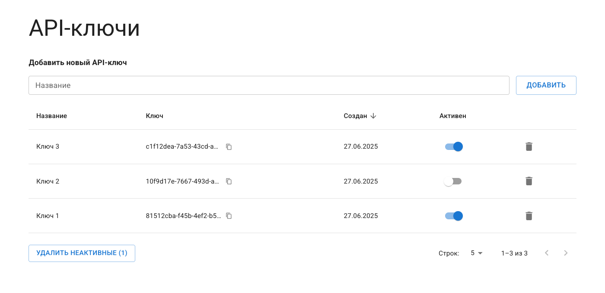

# Менеджер API-ключей

Пэт-проект, разработан для демонстрации навыков работы с React.



## Возможности

- Таблица API-ключей с хранением данных в Redux
- Модульная архитектура, использование паттерна Compound Components
- Сортировка и пагинация
- Библиотека компонентов MUI
- Оптимизация производительности: мемоизированные селекторы, функции и компоненты
- Семантическая разметка и ARIA-атрибуты
- Атомарные коммиты по спецификации Conventional Commits

## Стек

React 19, TypeScript, Redux Toolkit, MUI, React Hook Form, Yup, Vite

## Запуск

```bash
npm install
npm run dev
```

## Сборка

```bash
npm run build
npm run preview
```

## Демо

https://pavelmalyv.github.io/api-keys/
